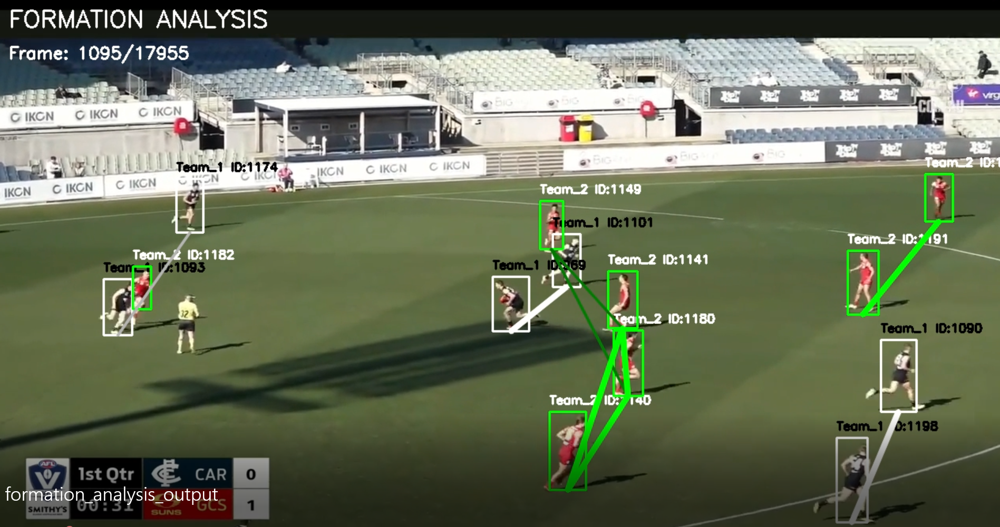

# AFL Formation Visualization and Tactical Connectivity Analysis

Formation visualization pipeline for AFL player tactical analysis using:

- YOLOv11 + ByteTrack tracking outputs
- Jersey colour clustering outputs
- Spatial teammate graph analysis
- Opponent lane blocking analysis
- Crowd suppression logic

This function generates a tactical formation visualization video where:

- teammates are connected using strong bold formation lines
- blocked tactical lanes are shown using faded thinner lines
- crowded tackle regions suppress formation rendering to avoid noisy visualizations

The system is designed to work AFTER the jersey colour clustering pipeline located at this folder:

```text
JerseyColorDetection
```

The tracking JSON produced by the JerseyColorDetection function is REQUIRED as input for this formation visualization stage.

---

# Pipeline Overview

```text
YOLOv11 + ByteTrack Tracking
            ↓
JerseyColorDetection
            ↓
Clustered Tracking JSON
            ↓
Formation Visualization
            ↓
Annotated Tactical Formation Video
```

---

# Tactical Visualization Explanation

The system converts players into a spatial tactical graph.

Each player becomes a node:

```text
Player = Tactical Node
```

Nearby teammates are connected to represent:

- formation structure
- support structure
- tactical spacing
- passing lane possibilities

---

# Meaning of the Visualization Lines

## Bold Bright Lines

Strong bold vivid lines represent:

```text
OPEN TACTICAL CONNECTIONS
```

Meaning:

- teammates are spatially connected
- no opponent is blocking tIhe lane
- support structure is available


This suggests a cleaner tactical connection between players of the same tema

---

## Faded Thin Lines

Thin faded lines represent:

```text
BLOCKED OR CONTESTED CONNECTIONS
```

Meaning:

- teammates are still structurally connected
- BUT an opponent is between them
- tactical lane is contested

This visually indicates defensive pressure or formation and connection disruption between 2 players

---

# Crowd Suppression Logic

During AFL tackles, scrums, or heavy congestion:

- too many players overlap spatially
- formation structure becomes meaningless
- visualization becomes noisy

The system detects local player density and suppresses line rendering in crowded regions.

This prevents:

```text
Spiderweb formation chaos
```

and produces cleaner tactical visualizations.

---

# Technologies Used

## Computer Vision

- OpenCV
- YOLOv11 detections
- ByteTrack player tracking

---

## Machine Learning

- KMeans jersey colour clustering
- HSV colour feature extraction

---

## Tactical Analysis

- K-Nearest Neighbour teammate graph
- Point-to-line opponent blocking analysis
- Spatial crowd density suppression

---

# IMPORTANT INPUT REQUIREMENT

This function DOES NOT perform:

- player detection
- player tracking
- jersey clustering

These MUST already be completed earlier using:

```text
JerseyColorDetection
```

The input tracking JSON MUST come from the JerseyColorDetection function output.

---

# Required Inputs

The system requires TWO inputs:

| Input | Description |
|---|---|
| AFL Video | Original AFL match video |
| Clustered Tracking JSON | Output JSON from JerseyColorDetection |

---

# Required JSON Source

The tracking file MUST be generated by:

```text
JerseyColorDetection
```

because this formation visualizer depends on this field

```json
"cluster_team"
```

which is the generated json output during jersey colour clustering.

---

# JSON Fields Used

The formation visualizer uses the following fields from the JSON:

| Field | Purpose |
|---|---|
| frame_number | Current frame index |
| player_id | Unique tracked player ID |
| bbox | Player bounding box |
| cluster_team | Team assignment from jersey clustering |

---

# Required Bounding Box Schema

```json
"bbox": {
  "x1": 948,
  "y1": 310,
  "x2": 967,
  "y2": 359
}
```

Coordinate meaning:

```text
(x1, y1) = top-left
(x2, y2) = bottom-right
```

---

# Required JSON Example

Example input JSON structure obtained from:

```text
JerseyColorDetection
```

```json
{
  "video_info": {
    "duration": 619.13,
    "fps": 29,
    "total_frames": 17955,
    "resolution": [1280, 720]
  },
  "tracking_results": [
    {
      "frame_number": 1,
      "players": [
        {
          "player_id": 1,
          "team_id": 1,
          "team_name": "GCS",
          "bbox": {
            "x1": 948,
            "y1": 310,
            "x2": 967,
            "y2": 359
          },
          "center": {
            "x": 958,
            "y": 334
          },
          "confidence": 0.79,
          "width": 19,
          "height": 49,
          "cluster_team": "Team_2"
        }
      ]
    }
  ]
}
```

---

# IMPORTANT FIELD USED FOR TEAM DECISION

The formation visualizer primarily uses:

```json
"cluster_team"
```

for tactical grouping.

This is preferred over:

```json
"team_id"
"team_name"
```

because cluster_team comes from the stabilized jersey colour clustering stage.

---

# Installation

## Recommended Python Version

```text
Python 3.10+
```

---

# Python Dependencies

Install required packages:

```bash
pip install opencv-python
```

---

# CLI Usage

## Basic Usage

```bash
python formation_visualizer.py \
    --input_video afl_video.mp4 \
    --input_tracking clustered_tracking.json \
    --output_video formation_output.mp4
```

---

# IMPORTANT

The tracking JSON MUST come from:

```text
JerseyColorDetection
```

because the formation visualizer depends on:

```json
"cluster_team"
```

generated during jersey colour clustering.

---

# Headless Mode

Disable live visualization window:

```bash
python formation_visualizer.py \
    --input_video afl_video.mp4 \
    --input_tracking clustered_tracking.json \
    --output_video formation_output.mp4 \
    --no_display
```

---

# Advanced Tactical Configuration

```bash
python formation_visualizer.py \
    --input_video afl_video.mp4 \
    --input_tracking clustered_tracking.json \
    --output_video formation_output.mp4 \
    --max_connection_distance 250 \
    --k_nearest 4 \
    --block_distance 40 \
    --crowd_radius 90 \
    --max_local_players 7
```

---

# CLI Parameters

| Parameter | Description |
|---|---|
| --input_video | Input AFL video |
| --input_tracking | Tracking JSON generated from JerseyColorDetection |
| --output_video | Output annotated formation video |
| --max_connection_distance | Maximum teammate connection distance |
| --k_nearest | Number of nearest teammates to connect |
| --block_distance | Opponent blocking threshold |
| --crowd_radius | Radius used for crowd detection |
| --max_local_players | Maximum nearby players before suppression |
| --no_display | Disable live visualization |

---

# Tactical Logic Overview

## Step 1 — Team Extraction

Players are grouped using:

```json
"cluster_team"
```

generated from JerseyColorDetection.

---

## Step 2 — Formation Graph Construction

Each player connects to:

```text
K nearest teammates
```

This creates a local tactical formation graph.

---

## Step 3 — Opponent Blocking Detection

The system computes:

```text
Point-to-line distance
```

to determine whether an opponent blocks the lane between teammates.

---

## Step 4 — Crowd Suppression

If too many players exist within a local radius:

- formation rendering is suppressed
- tactical graph edges are skipped

This avoids chaotic visual noise.

---

# Output

The system generates:

| Output | Description |
|---|---|
| Formation Analysis Video | Tactical formation visualization |

---

# Output Video Contains

The rendered video includes:

- player bounding boxes
- player IDs
- teammate tactical connections
- blocked tactical lanes
- crowd-aware suppression

---

# Example Output Frame

## Tactical Formation Visualization Output



---

# Backend Integration Notes

Backend systems should:

1. First run:

```text
JerseyColorDetection
```

2. Obtain the clustered tracking JSON output

3. Pass BOTH:

- video
- clustered tracking JSON

into:

```text
formation_visualizer.py
```

---

# Example Backend Flow

```text
Tracking Pipeline
        ↓
JerseyColorDetection
        ↓
clustered_tracking.json
        ↓
formation_visualizer.py
        ↓
formation_output.mp4
```

---

# Limitations

## 1. Tactical Approximation

This system visualizes:

```text
spatial tactical connectivity
```

NOT actual pass prediction.

---

## 2. Camera Perspective

Distance estimation currently uses:

```text
image-space geometry
```

instead of calibrated real-world field coordinates.

---

## 3. Broadcast Occlusion

Heavy player overlap may reduce:

- tactical clarity
- lane detection quality

---

# Future Improvements

Potential future upgrades:

- ball-aware tactical graphs
- temporal edge smoothing
- Voronoi territorial control maps
- passing probability estimation

---

# Summary

This module implements a tactical AFL formation visualization pipeline using:

- YOLOv11 tracking outputs
- JerseyColorDetection clustered tracking JSON
- spatial teammate graph analysis
- opponent lane blocking detection
- crowd-aware formation suppression

The system generates a tactical annotated video showing:

- open tactical structures
- blocked formation lanes
- teammate connectivity
- spatial tactical organization

while remaining modular and fully CLI-compatible for backend integration.

```