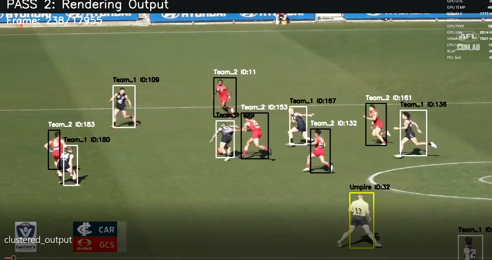

# AFL Jersey Colour Clustering and Team Assignment

Offline jersey colour clustering pipeline for AFL player tracking analytics.

This project performs:

- Offline player jersey colour analysis
- Unsupervised team clustering using KMeans
- Video annotation rendering
- Player metric extraction
- JSON and CSV analytics export

The system is designed to work **after** a player tracking stage has already been completed by running the video through Project\redback-orion\26_T1\afl_player_tracking_and_crowd_monitoring\player_tracking_logic\Yolov11_ByteTrack_Player_Tracking

The tracking stage generates a JSON file containing:

- player IDs
- bounding boxes
- tracking information

This pipeline then uses those detections to:

1. Extract jersey colour features
2. Build representative player colour vectors across the whole video not per frame
3. Cluster players into teams
4. Render annotated videos
5. Export analytics data

---

# Pipeline Overview

```text
YOLOv11 + ByteTrack Tracking
            ↓
Tracking JSON
            ↓
Offline Jersey Colour Feature Extraction
            ↓
Global KMeans Clustering (for the whole video length)
            ↓
Cluster Assignment Per Player based on Image color
            ↓
Annotated Video + JSON + CSV Outputs
```

---

# Key Features

## 1. Offline Colour Clustering

Unlike frame-by-frame classification systems, this implementation:

- collects colour samples over the entire video
- builds stable player colour profiles
- performs clustering globally
- avoids unstable frame-level team switching

This significantly improves robustness.

---


## 2. Memory Safe Processing

Long sports videos can contain:

- tens of thousands of frames
- hundreds of thousands of detections

The implementation avoids loading everything into RAM simultaneously by:

- sequential frame processing
- storing only extracted feature vectors
- using representative median vectors per player

---

## 3. Fully CLI Ready

Supports configurable parameters:

- cluster count
- frame sampling
- output folders
- headless mode
- filtering thresholds

---

# Requirements

## Python Version

Recommended:

```text
Python 3.10+
```

---

# Python Dependencies

Install dependencies:

```bash
pip install opencv-python numpy scikit-learn
```

---

# Required Input Files

The system requires TWO inputs:

| Input | Description |
|---|---|
| Video File | Original AFL match video |
| Tracking JSON | Generated earlier from YOLOv11 + ByteTrack |

---

# IMPORTANT: Tracking JSON Requirement

This project DOES NOT generate tracking data itself.

You MUST first run the video through the tracking folder first

```text
Yolov11_ByteTrack_Player_Tracking
```

which produces a tracking JSON similar to:

```json
{
  "video_info": {
    "duration": 619.13,
    "fps": 29,
    "total_frames": 17955,
    "resolution": [1280, 720]
  },
  "tracking_results": [
    {
      "frame_number": 1,
      "timestamp": 0.0,
      "players": [
        {
          "player_id": 1,
          "team_id": 1,
          "team_name": "GCS",
          "bbox": {
            "x1": 948,
            "y1": 310,
            "x2": 967,
            "y2": 359
          },
          "center": {
            "x": 958,
            "y": 334
          },
          "confidence": 0.79,
          "width": 19,
          "height": 49
        }
      ]
    }
  ]
}
```

---

# Expected Tracking JSON Structure

The following fields are REQUIRED:

| Field | Description |
|---|---|
| frame_number | Current frame index |
| player_id | Unique tracking ID |
| bbox | Bounding box coordinates |
| confidence | Detection confidence |

---

# Required Bounding Box Schema

```json
"bbox": {
  "x1": 948,
  "y1": 310,
  "x2": 967,
  "y2": 359
}
```

Coordinate format:

```text
(x1, y1) = top-left
(x2, y2) = bottom-right
```

---

# How The Clustering Works

## Step 1 — ROI Extraction

Only the torso region is used.

This avoids contamination from:

- grass
- shorts
- socks
- field markings
- crowd background

---

## Step 2 — HSV Feature Extraction

Features extracted:

| Feature | Description |
|---|---|
| Median Hue | Dominant jersey hue |
| Median Saturation | Colour saturation |
| Median Value | Brightness |
| Red Ratio | Percentage of red pixels |
| Yellow Ratio | Percentage of yellow pixels |
| Blue Ratio | Percentage of blue pixels |
| White Ratio | Percentage of white pixels |
| Dark Ratio | Percentage of dark pixels |

---

## Step 3 — Representative Player Vectors

Instead of clustering every frame independently:

- all samples per player are collected
- median feature vector is computed

This produces stable colour signatures.

---

## Step 4 — Global KMeans Clustering

KMeans groups players into:

```text
Cluster_0
Cluster_1
Cluster_2
...
```

Typical usage:

| Cluster | Meaning |
|---|---|
| Cluster_0 | Team 1 |
| Cluster_1 | Team 2 |
| Cluster_2 | Umpire |

The clustering is fully unsupervised.

No team labels are used during training.

---

# CLI Usage

## Basic Usage

```bash
python color_detection.py \
    --input_video afl_video.mp4 \
    --tracking_json afl_tracking.json
```

---

# Custom Output Folder

```bash
python color_detection.py \
    --input_video afl_video.mp4 \
    --tracking_json afl_tracking.json \
    --output_folder outputs
```

---

# Headless Mode

Disable live display:

```bash
python color_detection.py \
    --input_video afl_video.mp4 \
    --tracking_json afl_tracking.json \
    --no_display
```

---

# Advanced Example

```bash
python color_detection.py \
    --input_video afl_video.mp4 \
    --tracking_json afl_tracking.json \
    --clusters 4 \
    --process_every 3 \
    --min_box_width 25 \
    --min_box_height 50
```

---

# CLI Parameters

| Parameter | Description |
|---|---|
| --input_video | Input video |
| --tracking_json | Tracking JSON |
| --output_folder | Output directory |
| --clusters | Number of KMeans clusters |
| --process_every | Process every N frames |
| --min_box_width | Minimum detection width |
| --min_box_height | Minimum detection height |
| --min_samples_per_track | Minimum samples required per player |
| --pixel_to_meter | Pixel-to-meter conversion |
| --max_speed_kmh | Speed clamp |
| --no_display | Disable live visualization |

---

# Outputs

The system generates:

| Output | Description |
|---|---|
| Annotated Video | Cluster-labelled video |
| JSON File | Structured clustered tracking |
| CSV File | Player movement metrics |

---

# Output Video

The rendered video contains:

- bounding boxes
- player IDs
- cluster labels
- team colouring

---

# Output JSON Schema

Example:

```json
{
  "video_info": {
    "duration": 619.13,
    "fps": 29,
    "total_frames": 17955,
    "resolution": [1280, 720]
  },
  "tracking_results": 
    {
      "frame_number": 1,
      "players": 
        {
          "player_id": 1,
          "team_id": 1,
          "team_name": "GCS",
          "bbox": {
            "x1": 948,
            "y1": 310,
            "x2": 967,
            "y2": 359
          },
          "center": {
            "x": 958,
            "y": 334
          },
          "confidence": 0.79,
          "width": 19,
          "height": 49,
          "cluster_team": "Team_2"
        },
    }
}
```

# Example Output Frame

## Annotated Output Video Frame



---

# Limitations

## 1. Cluster IDs Are Arbitrary

KMeans does not know:

- actual team names
- club identities

Clusters are unsupervised.

We may manually map later:

```text
Cluster_0 → Brisbane Lions
Cluster_1 → West Coast Eagles
```

after inspection.

---

## 2. Lighting Sensitivity

Performance may degrade under:

- heavy shadows
- stadium lighting changes
- rain conditions
- motion blur

---

## 3. Similar Jerseys

Very similar team colours may require:

- more clusters
- temporal smoothing
- OCR integration
- logo detection

---

# Future Improvements

Potential upgrades:

- DeepSORT/ReID integration
- GPU batch ROI extraction
- Team identity identification using the scoreboard
- Semi-supervised clustering (depending on how we supply the input tracking file)
- Jersey number OCR fusion

---

# Summary

This function implements a robust offline AFL jersey colour clustering pipeline using:

- YOLOv11 tracking outputs
- torso-based colour extraction
- global KMeans clustering
- sequential memory-safe processing

The system generates:

- annotated videos
- structured JSON
- player metric CSV analytics

while remaining modular and scalable for long-form sports analysis.

---

# Acknowledgement

Drew Neeling: For the color processing logic and Per frame KMeans clustering approach
